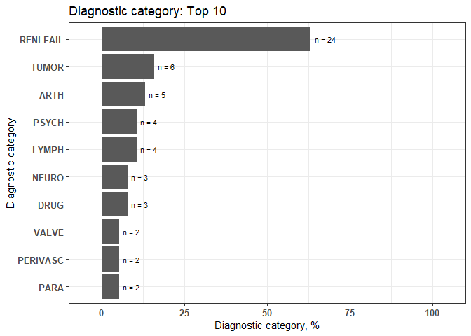

Sample Code in dxpr paper
================
Yi-Ju Tseng, Hsiang-Ju Chiu, Chun-Ju Chen

dxpr: An R package for generating analysis-ready data from electronic
health records—diagnoses and procedures

# Preparation for analysis

``` r
devtools::install_github("DHLab-TSENG/dxpr")
```

``` r
library(dxpr)
```

# Data integration

## Code format transformation

``` r
ICD_Decimal <- icdDxShortToDecimal(dxDataFile = sampleDxFile,
                                   icdColName = ICD,
                                   dateColName = Date, 
                                   icd10usingDate = "2015/10/01")
sampleDxFile$Decimal <- ICD_Decimal$ICD
head(sampleDxFile)
```

    ##     ID  ICD       Date Decimal
    ## 1:  A2 Z992 2020-05-22   Z99.2
    ## 2:  A5 Z992 2020-01-24   Z99.2
    ## 3:  A8 Z992 2015-10-27   Z99.2
    ## 4: A13 Z992 2020-04-26   Z99.2
    ## 5: A13 Z992 2025-02-02   Z99.2
    ## 6: A15 Z992 2023-05-12   Z99.2

``` r
tail(ICD_Decimal$Error)
```

    ##       ICD count IcdVersionInFile     WrongType Suggestion
    ## 1:  75.52     4            ICD 9  Wrong format           
    ## 2:  E03.0     4            ICD 9 Wrong version           
    ## 3:    650     4           ICD 10 Wrong version           
    ## 4: 123.45     3           ICD 10  Wrong format           
    ## 5:  755.2     3            ICD 9  Wrong format     755.29
    ## 6:   7552     2            ICD 9  Wrong format      75529

## Code grouping

``` r
CCS_description <- icdDxToCCS(dxDataFile = sampleDxFile,
                              idColName = ID,
                              icdColName = ICD,
                              dateColName = Date, 
                              icd10usingDate = "2015-10-01", 
                              isDescription = TRUE)
CCS_description$groupedDT[CCS_description$groupedDT$ID=="A0",]
```

    ##    Short ID   ICD       Date CCS_CATEGORY_DESCRIPTION
    ## 1:  5855 A0  5855 2013-12-20   Chronic kidney disease
    ## 2: V4511 A0 V4511 2012-04-05   Chronic kidney disease
    ## 3:  V560 A0  V560 2010-03-28   Chronic kidney disease
    ## 4:  5853 A0  5853 2010-10-29   Chronic kidney disease
    ## 5:  5856 A0  5856 2009-07-25   Chronic kidney disease
    ## 6:   001 A0   001 2014-11-05                     <NA>
    ## 7: A0.11 A0 A0.11 2017-01-31                     <NA>
    ## 8: A0.11 A0 A0.11 2023-08-12                     <NA>

# Data wrangling

## Case selection

``` r
Case <- selectCases(dxDataFile = sampleDxFile,
                    idColName = ID,
                    icdColName = ICD, 
                    dateColName = Date, 
                    icd10usingDate = "2015/10/01",
                    groupDataType = ccslvl2,
                    caseCondition = "Diseases of the urinary system",
                    isDescription = TRUE,
                    caseCount = 1,
                    periodRange = c(30, 365)) 
head(Case)
```

    ##     ID selectedCase count firstCaseDate endCaseDate    period MostCommonICD
    ## 1:  A3     Selected     5    2008-07-08  2014-02-24 2057 days          V420
    ## 2:  A1     Selected     5    2006-11-29  2014-09-24 2856 days          5855
    ## 3: A10     Selected     5    2007-11-04  2012-07-30 1730 days         V5631
    ## 4: A12     Selected     5    2006-05-14  2015-06-29 3333 days          5859
    ## 5: A13     Selected     5    2006-04-29  2025-02-02 6854 days          5855
    ## 6: A15     Selected     5    2007-05-25  2023-05-12 5831 days         V5631
    ##    MostCommonICDCount
    ## 1:                  3
    ## 2:                  2
    ## 3:                  2
    ## 4:                  2
    ## 5:                  2
    ## 6:                  2

``` r
tail(Case)
```

    ##    ID selectedCase count firstCaseDate endCaseDate  period MostCommonICD
    ## 1: D3 non-Selected    NA          <NA>        <NA> NA days          <NA>
    ## 2: D4 non-Selected    NA          <NA>        <NA> NA days          <NA>
    ## 3: D5 non-Selected    NA          <NA>        <NA> NA days          <NA>
    ## 4: D6 non-Selected    NA          <NA>        <NA> NA days          <NA>
    ## 5: D7 non-Selected    NA          <NA>        <NA> NA days          <NA>
    ## 6: D8 non-Selected    NA          <NA>        <NA> NA days          <NA>
    ##    MostCommonICDCount
    ## 1:                 NA
    ## 2:                 NA
    ## 3:                 NA
    ## 4:                 NA
    ## 5:                 NA
    ## 6:                 NA

## Eligible period identification

``` r
admissionDate <- getEligiblePeriod(dxDataFile = sampleDxFile,
                                   idColName = ID,
                                   dateColName = Date)
head(admissionDate) 
```

    ##     ID firstRecordDate endRecordDate
    ## 1:  D6      2005-10-09    2025-01-05
    ## 2: A12      2006-01-12    2022-06-12
    ## 3:  D1      2006-02-12    2024-04-04
    ## 4: A13      2006-04-29    2025-02-02
    ## 5:  A9      2006-06-30    2023-12-10
    ## 6:  D2      2006-09-01    2025-08-11

## Data splitting based on index date and moving window

``` r
indexDateTable <- data.frame (ID = c("A0","B0","C0","D0"),
                              indexDate = c("2023-08-12", "2015-12-26",
                                            "2015-12-05", "2017-01-29"))
Data <- splitDataByDate(dxDataFile = sampleDxFile[grepl("A0|B0|C0|D0",ID),],
                        idColName = ID,
                        icdColName = ICD,
                        dateColName = Date,
                        indexDateFile = indexDateTable,
                        gap = 30)
Data[6:11,]
```

    ##    ID   ICD       Date  indexDate timeTag window
    ## 1: A0   001 2014-11-05 2023-08-12       B    107
    ## 2: A0 A0.11 2017-01-31 2023-08-12       B     80
    ## 3: A0 A0.11 2023-08-12 2023-08-12       A      1
    ## 4: B0  N185 2015-12-26 2015-12-26       A      1
    ## 5: B0  N189 2017-11-27 2015-12-26       A     24
    ## 6: B0 A0.11 2017-12-19 2015-12-26       A     25

## Condition era generation

``` r
Era <- getConditionEra(dxDataFile = sampleDxFile,
                       idColName = ID,
                       icdColName = ICD,
                       dateColName = Date,
                       icd10usingDate = "2015/10/01",
                       groupDataType = CCS,
                       isDescription = FALSE,
                       gapDate = 360)
head(Era)
```

    ##    ID CCS_CATEGORY era firstCaseDate endCaseDate count   period
    ## 1: A0          158   1    2009-07-25  2010-10-29     3 461 days
    ## 2: A0          158   2    2012-04-05  2012-04-05     1   0 days
    ## 3: A0          158   3    2013-12-20  2013-12-20     1   0 days
    ## 4: A1          158   1    2006-11-29  2006-11-29     1   0 days
    ## 5: A1          158   2    2008-06-25  2008-06-25     1   0 days
    ## 6: A1          158   3    2012-06-19  2013-04-28     2 313 days

## Analysis-ready data generation

``` r
CHARLSON <- icdDxToComorbid(dxDataFile = sampleDxFile,
                            idColName = ID,
                            icdColName = ICD,
                            dateColName = Date,
                            icd10usingDate = "2015-10-01",
                            comorbidMethod = CHARLSON)
groupedData_Wide <- groupedDataLongToWide(dxDataFile  = CHARLSON$groupedDT,
                                          idColName = ID,
                                          categoryColName = Comorbidity,
                                          dateColName = Date,
                                          reDup = TRUE,
                                          numericOrBinary = B,
                                          count = 2)
head(groupedData_Wide, 5)
```

    ##     ID CANCER  CEVD  COPD DIAB_C  MSLD  PARA   PUD   PVD   RD Rheum
    ## 1:  A0  FALSE FALSE FALSE  FALSE FALSE FALSE FALSE FALSE TRUE FALSE
    ## 2:  A1  FALSE FALSE FALSE  FALSE FALSE FALSE FALSE FALSE TRUE FALSE
    ## 3: A10  FALSE FALSE FALSE  FALSE FALSE FALSE FALSE FALSE TRUE FALSE
    ## 4: A11  FALSE FALSE FALSE  FALSE FALSE FALSE FALSE FALSE TRUE FALSE
    ## 5: A12  FALSE FALSE FALSE  FALSE FALSE FALSE FALSE FALSE TRUE FALSE

# Visualization

## Pareto chart of error ICD

``` r
error <- icdDxDecimalToShort(dxDataFile = sampleDxFile,
                             icdColName = ICD,
                             dateColName = Date,
                             icd10usingDate = "2015/10/01")
plot1 <- plotICDError(errorFile = error$Error,
                      icdVersion = all,
                      wrongICDType = all,
                      groupICD = FALSE,
                      others = TRUE, 
                      topN = 10)
plot1$graph
```

<!-- -->

``` r
plot1$ICD
```

    ##        ICD count CumCountPerc IcdVersionInFile     WrongType Suggestion
    ##  1:  A0.11    20       18.35%           ICD 10  Wrong format           
    ##  2:  V27.0    18       34.86%           ICD 10 Wrong version           
    ##  3:   E114     8        42.2%           ICD 10  Wrong format           
    ##  4: A01.05     8       49.54%            ICD 9 Wrong version           
    ##  5:  42761     7       55.96%           ICD 10 Wrong version           
    ##  6:  Z9.90     6       61.47%           ICD 10  Wrong format           
    ##  7:    F42     6       66.97%           ICD 10  Wrong format           
    ##  8:  V24.1     6       72.48%           ICD 10 Wrong version           
    ##  9:  A0105     5       77.06%            ICD 9 Wrong version           
    ## 10:    001     5       81.65%            ICD 9  Wrong format       0019
    ## 11: others    20         100%            ICD 9  Wrong format

## Bar chart of diagnostic categories

``` r
ELIX <- icdDxToComorbid(dxDataFile  = sampleDxFile,
                        idColName = ID,
                        icdColName = ICD,
                        dateColName = Date,
                        icd10usingDate = "2015-10-01",
                        comorbidMethod = ELIX)
groupedDataWide <- groupedDataLongToWide(dxDataFile  = ELIX$groupedDT,
                                         idColName = ID,
                                         categoryColName = Comorbidity,
                                         dateColName = Date,
                                         reDup = TRUE,
                                         numericOrBinary = B)
plot2 <- plotDiagCat(groupedDataWide = groupedDataWide,
                     idColName = ID,
                     topN = 10,
                     limitFreq = 0.01)
plot2$graph
```

<!-- -->

``` r
plot2$sigCate
```

    ##     DiagnosticCategory  N Percentage
    ##  1:           RENLFAIL 24      63.16
    ##  2:              TUMOR  6      15.79
    ##  3:               ARTH  5      13.16
    ##  4:              LYMPH  4      10.53
    ##  5:              PSYCH  4      10.53
    ##  6:               DRUG  3       7.89
    ##  7:              NEURO  3       7.89
    ##  8:               PARA  2       5.26
    ##  9:           PERIVASC  2       5.26
    ## 10:              VALVE  2       5.26
